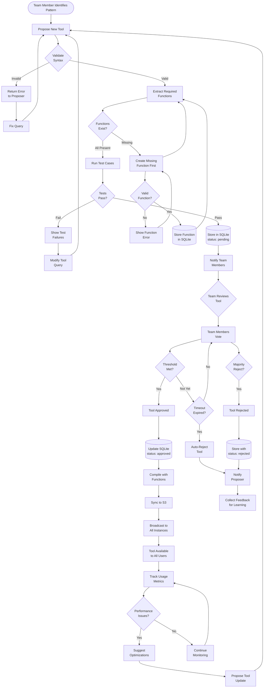

# Super Data MCP

A Model Context Protocol (MCP) server that provides LLMs with sophisticated data querying capabilities across multiple data sources.

## Features

- 🔍 **Advanced JSON Querying**: Powerful jq with functions and complex transformations
- 👥 **Team Collaboration**: Multi-user support with approval workflows and shared tools
- 📊 **Multi-Dataset Support**: Query across multiple JSON datasets
- 🔄 **S3 Synchronization**: Automatic database sync for distributed teams
- 🧩 **jq Function Library**: Reusable functions with dependency management
- 📝 **Schema Generation**: Automatic JSON Schema generation with versioning
- 🚀 **High Performance**: SQLite with WAL mode for concurrent access
- 🔧 **Extensible Architecture**: Plugin-based design for future data sources
- 🛠️ **Dynamic Tools**: Import from YAML or create via learning system
- 📚 **Schema Evolution**: Automatic versioning and migration of changing data
- 🧠 **Self-Training**: Learn and create new tools with team approval
- 🔐 **User Attribution**: Complete audit trail of who created/modified tools

## Installation

### Prerequisites

- Python 3.12+
- jq command-line tool
- uv package manager (recommended)

### Quick Start

```bash
# Clone the repository
git clone https://github.com/yourusername/super-data.git
cd super-data

# Install with uv (recommended)
uv pip install -e .

# Or install with pip
pip install -e .

# Install jq (if not already installed)
# macOS
brew install jq
# Ubuntu/Debian
sudo apt-get install jq
# Windows
choco install jq
```

## Configuration

### Environment Variables

Create a `.env` file in the project root:

```bash
# Core Configuration
SUPER_DATA_DATASETS_PATH=/path/to/datasets
SUPER_DATA_DATABASE_PATH=./database/tools.db
SUPER_DATA_LOG_LEVEL=INFO

# Transport Configuration (HTTP for teams, stdio for local)
SUPER_DATA_TRANSPORT=http  # http/stdio
SUPER_DATA_HOST=0.0.0.0
SUPER_DATA_PORT=8080

# S3 Configuration (required for team synchronization)
SUPER_DATA_S3_BUCKET=team-data-bucket
SUPER_DATA_S3_DB_KEY=databases/tools.db
SUPER_DATA_SYNC_INTERVAL=30  # seconds
AWS_REGION=us-east-1
AWS_ACCESS_KEY_ID=your-key
AWS_SECRET_ACCESS_KEY=your-secret

# Team Configuration
SUPER_DATA_APPROVAL_THRESHOLD=2  # votes needed for tool approval
SUPER_DATA_AUTO_APPROVE_TIMEOUT=24  # hours before auto-rejection
SUPER_DATA_ENABLE_LEARNING=true

# Performance
SUPER_DATA_QUERY_TIMEOUT_SECONDS=30
SUPER_DATA_MAX_RESULT_SIZE_MB=100
SUPER_DATA_CACHE_SIZE_MB=500
```

### MCP Server Configuration

For team deployment with HTTP transport:

```json
{
  "mcpServers": {
    "super-data": {
      "url": "https://your-team-server.com:8080",
      "transport": "http",
      "headers": {
        "X-User-Id": "your-username",
        "Authorization": "Bearer your-token"
      }
    }
  }
}
```

For local development with stdio:

```json
{
  "mcpServers": {
    "super-data": {
      "command": "python",
      "args": [
        "-m",
        "super_data",
        "--transport", "stdio"
      ]
    }
  }
}
```

## Dataset Structure

### Directory Layout

```
datasets/
├── datasets.yml          # Dataset metadata
├── json/
│   ├── functions.yaml   # Shared jq function library
│   ├── tools.yml        # Seed tool definitions
│   ├── sales.json       # Dataset file
│   ├── sales.yaml       # Dataset schema/metadata
│   └── ...
```

### jq Function Library (functions.yaml)

```yaml
functions:
  - name: calculate_efficiency
    description: "Calculate efficiency ratio"
    definition: |
      def calculate_efficiency($revenue; $cost):
        if $cost > 0 then
          (($revenue - $cost) / $cost * 100) | floor
        else 0 end;
    parameters:
      - revenue: number
      - cost: number

  - name: analyze_performance
    description: "Complex performance analysis"
    definition: |
      def analyze_performance(target_code):
        (.codes[] | select(.code == target_code)) as $data |
        # Complex multi-step analysis
        {
          code: target_code,
          metrics: calculate_efficiency($data.revenue; $data.cost),
          status: if $data.revenue > 1000 then "good" else "poor" end
        };
    depends_on: [calculate_efficiency]
```

### Tool Definition with Functions (tools.yml)

```yaml
tools:
  - name: "analyze_sales"
    description: "Analyze sales with efficiency calculation"
    query: |
      # Functions are automatically compiled
      analyze_performance("${code}")
    required_functions:
      - analyze_performance
      - calculate_efficiency
    parameters:
      - name: "code"
        type: "string"
        required: true
    datasets: ["sales"]
```

### Database Storage

All tools and functions are stored in SQLite after initial import:

```sql
-- Functions and tools are versioned and tracked
SELECT name, created_by, approval_status, usage_count
FROM tools
WHERE source = 'learned'
ORDER BY usage_count DESC;
```

## Usage Examples

### Basic Query with Function

```python
# Via MCP client - function is automatically compiled
result = await client.call_tool(
    "analyze_sales",
    {
        "code": "SALES2024"
    }
)
```

### Team Collaboration: Proposing a New Tool

```python
# Team member identifies a useful pattern and proposes it
proposal = await client.call_tool(
    "propose_new_tool",
    {
        "tool_name": "customer_cohort_analysis",
        "tool_description": "Analyze customer cohorts with retention metrics",
        "query_template": """
            # Use existing efficiency function
            def cohort_retention($cohort_month):
              .customers
              | map(select(.signup_month == $cohort_month))
              | group_by(.retention_months)
              | map({
                  month: .[0].retention_months,
                  retained: length,
                  efficiency: calculate_efficiency(
                    (map(.revenue) | add),
                    (map(.acquisition_cost) | add)
                  )
                });

            cohort_retention("${cohort_month}")
        """,
        "required_functions": ["calculate_efficiency"],
        "parameters": [
            {"name": "cohort_month", "type": "string", "required": true}
        ],
        "justification": "Need to track cohort performance for board meeting"
    }
)

# Other team members review and vote
await client.call_tool(
    "vote_on_tool",
    {
        "tool_id": proposal["tool_id"],
        "vote": "approve",
        "comment": "Very useful for our monthly reports"
    }
)

# Once approved (2+ votes), everyone can use it immediately
result = await client.call_tool(
    "customer_cohort_analysis",
    {
        "cohort_month": "2024-01"
    }
)
```

### Managing Shared Functions

```python
# List all available functions
functions = await client.call_tool("list_functions")

# Create a new shared function
await client.call_tool(
    "create_function",
    {
        "name": "calculate_mrr",
        "definition": """
            def calculate_mrr($customers):
              $customers
              | map(select(.status == "active"))
              | map(.monthly_payment)
              | add;
        """,
        "description": "Calculate Monthly Recurring Revenue"
    }
)

# Use in a new tool
await client.call_tool(
    "propose_new_tool",
    {
        "tool_name": "mrr_by_segment",
        "query_template": """
            .segments[] |
            {
              segment: .name,
              mrr: calculate_mrr(.customers)
            }
        """,
        "required_functions": ["calculate_mrr"]
    }
)
```

### Team Activity Monitoring

```python
# See who's been creating tools
activity = await client.call_tool(
    "get_team_activity",
    {
        "days": 7
    }
)

# View tool usage statistics
stats = await client.call_tool(
    "get_tool_stats",
    {
        "period": "month"
    }
)
```

### Schema Version Handling

```python
# Check dataset compatibility
info = await client.call_tool(
    "introspect_dataset",
    {
        "dataset": "sales"
    }
)

print(f"Data version: {info['data_version']}")
print(f"Schema version: {info['schema_version']}")
print(f"Compatible: {info['is_compatible']}")

# Data will be auto-migrated if needed
```

## Development

### Project Structure

```
super-data/
├── src/
│   ├── core/           # MCP server core
│   ├── data/           # Data providers and schemas
│   │   ├── providers/
│   │   └── schemas/
│   │       ├── versioning.py
│   │       └── migrations.py
│   ├── query/          # Query engines
│   ├── learning/       # Self-training system
│   │   ├── database.py
│   │   ├── models.py
│   │   └── validator.py
│   ├── tools/          # MCP tools
│   └── utils/          # Utilities
├── datasets/           # Default datasets directory
├── database/           # Learned tools storage
│   └── learned_tools.db
├── tests/              # Test suite
└── config/             # Configuration files
```

### Running Tests

```bash
# Run all tests
pytest

# Run with coverage
pytest --cov=src

# Run specific test file
pytest tests/unit/test_query_engine.py
```

### Development Setup

```bash
# Install development dependencies
uv pip install -e ".[dev]"

# Run linting
ruff check src/

# Run type checking
mypy src/

# Format code
black src/
```

## Architecture

### Database-First Design

The server uses SQLite as the single source of truth for all tools, functions, and metadata:

- **Central Storage**: All tools and functions stored in SQLite database
- **YAML Seeds**: Configuration files only used for initial database population
- **Version Control**: Complete history tracking with user attribution
- **Team Sync**: S3-based database synchronization for distributed teams

### jq Function System

Powerful function composition with dependency management:

- **Shared Functions**: Reusable jq functions stored in database
- **Dependency Resolution**: Automatic compilation of required functions
- **Function Composition**: Build complex queries from simple functions
- **Version Tracking**: Function versions with migration support

### Query Engine

Currently focused on jq with future extensibility:

- **jq** (primary): Full programming language with functions, transformations, aggregations
- **SQL** (planned): Familiar syntax via DuckDB for joins across datasets

### Data Provider Abstraction

Extensible data source providers:

- **Filesystem**: Local JSON files with file watching
- **S3**: Dataset synchronization with delta updates
- **API** (planned): REST API endpoints
- **Database** (planned): Direct database connections

### Team Collaboration Features

Built for multi-user environments:

- **User Attribution**: Track who created/modified each tool
- **Approval Workflow**: Voting system for new tools
- **Real-time Updates**: Changes propagate immediately to all users
- **Conflict Resolution**: Optimistic locking with retry logic
- **Audit Trail**: Complete history of all changes

#### Approval Workflow



### S3 Synchronization Strategy

Distributed teams stay in sync:

```
1. Check for lock → 2. Acquire lock → 3. Download latest
4. Merge changes → 5. Upload database → 6. Release lock
```

### Performance Optimizations

- **WAL Mode**: SQLite Write-Ahead Logging for concurrent access
- **Connection Pooling**: Efficient database connection management
- **Query Compilation**: Pre-compile frequently used function combinations
- **Result Streaming**: Handle large datasets without memory overflow
- **Intelligent Caching**: Cache compiled queries and function dependencies

## Roadmap

### Phase 1: Foundation (Current)
- [x] Core MCP server implementation
- [x] SQLite database layer with WAL mode
- [x] jq query engine with function support
- [x] HTTP transport for team access
- [x] User attribution system

### Phase 2: Team Features (In Progress)
- [ ] S3 database synchronization
- [ ] Distributed locking mechanism
- [ ] Approval workflow with voting
- [ ] Function dependency resolution
- [ ] Tool compilation system

### Phase 3: Enhancement (Planned)
- [ ] WebSocket support for real-time updates
- [ ] SQL query support via DuckDB
- [ ] Query optimization with execution plans
- [ ] Advanced caching with Redis
- [ ] REST API data provider

### Phase 4: Scale (Future)
- [ ] Multi-tenant support
- [ ] Role-based access control
- [ ] Distributed query execution
- [ ] Cross-team tool sharing
- [ ] Enterprise SSO integration

## Team Deployment

### Server Setup

For production team deployment:

```bash
# 1. Initialize database with seed data
python -m super_data init --seed

# 2. Configure S3 sync
export SUPER_DATA_S3_BUCKET=team-bucket
export SUPER_DATA_SYNC_INTERVAL=30

# 3. Start HTTP server for team access
python -m super_data serve --transport=http --port=8080
```

### Client Configuration

Each team member configures their MCP client:

```json
{
  "mcpServers": {
    "super-data": {
      "url": "https://your-server.com:8080",
      "transport": "http",
      "headers": {
        "X-User-Id": "alice",  // Unique per user
        "X-Team-Id": "engineering"
      }
    }
  }
}
```

### Database Management

```bash
# Export approved tools for sharing
super-data export --type=approved --output=tools.json

# Import tools from another team
super-data import --input=shared_tools.json --approve

# Backup database before updates
super-data backup --s3

# View pending tool approvals
super-data pending-approvals
```

## Troubleshooting

### Common Issues

**Database locked**: Enable WAL mode for concurrent access
```bash
sqlite3 database/tools.db "PRAGMA journal_mode=WAL;"
```

**S3 sync conflicts**: Check lock status
```bash
aws s3 ls s3://bucket/databases/tools.db.lock
# Remove stale lock if needed
aws s3 rm s3://bucket/databases/tools.db.lock
```

**Function not found**: Verify function dependencies
```sql
SELECT * FROM function_dependencies WHERE function_id = 'your_function';
```

**Tool approval stuck**: Check voting status
```sql
SELECT * FROM approval_votes WHERE tool_id = 'tool_id';
```

**jq compilation errors**: Test function separately
```bash
echo '{"test": "data"}' | jq 'def your_function: ...; your_function'
```

**Performance issues**: Check execution logs
```sql
SELECT tool_id, AVG(execution_time_ms), COUNT(*)
FROM tool_execution_log
GROUP BY tool_id
ORDER BY AVG(execution_time_ms) DESC;
```

## Self-Training Configuration

### Enabling Tool Learning

The self-training system allows the LLM to propose new tools based on usage patterns. Configuration:

```yaml
# config.yaml
learning:
  enabled: true
  database_path: "./database/learned_tools.db"
  require_approval: true  # Always require user approval
  auto_test: true         # Test proposed tools automatically
  performance_tracking: true
  cleanup_unused_days: 90  # Remove unused tools after 90 days

  limits:
    max_pending_tools: 10
    max_query_complexity: 1000  # Complexity score limit
    max_execution_time_ms: 5000
```

### Approval Workflow

1. **LLM proposes tool** via `propose_new_tool`
2. **System tests** the tool with provided test cases
3. **User reviews** via notification or dashboard
4. **User approves/rejects** via `approve_tool`
5. **Tool becomes available** immediately upon approval

### Managing Learned Tools

```bash
# List all learned tools
super-data list-learned-tools

# Review pending proposals
super-data review-proposals

# Export learned tools
super-data export-tools --output=my_tools.yaml

# Import tools from another instance
super-data import-tools --input=shared_tools.yaml
```

## Contributing

We welcome contributions! Please see [CONTRIBUTING.md](CONTRIBUTING.md) for guidelines.

## License

MIT License - see [LICENSE](LICENSE) file for details.

## Support

- **Documentation**: [docs/](docs/)
- **Issues**: [GitHub Issues](https://github.com/yourusername/super-data/issues)
- **Discussions**: [GitHub Discussions](https://github.com/yourusername/super-data/discussions)

## Acknowledgments

- Built on [Model Context Protocol](https://github.com/modelcontextprotocol/python-sdk)
- Query engine powered by [jq](https://jqlang.github.io/jq/)
